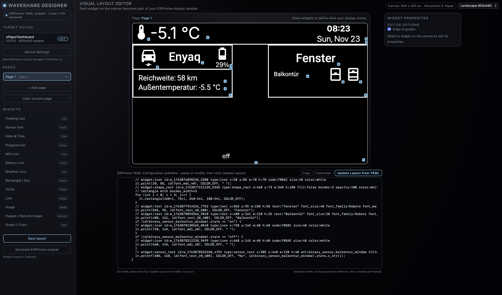

# Waveshare E-Paper Dashboard Designer

**A visual drag-and-drop dashboard designer for Waveshare E-Paper displays with ESPHome!**

This is a fork of the excellent [ReTerminal Designer](https://github.com/koosoli/ReTerminalDesigner) adapted to work with affordable Waveshare E-Paper displays and the Waveshare ESP32 Driver Board.




## 🎯 What This Does

Instead of hand-coding ESPHome display lambdas, design your e-paper dashboard **visually** in Home Assistant:
- 🖱️ Drag and drop widgets (text, sensors, icons, shapes, graphs)
- 📐 See live preview with your actual Home Assistant entities  
- 🔄 Auto-generates clean ESPHome YAML configuration
- 📦 Supports multiple display sizes and models
- 📄 Multiple pages with navigation

## 🖼️ Supported Displays

| Model | Size | Resolution | Colors | Status |
|-------|------|------------|--------|--------|
| 2.90in | 2.9" | 296×128 | B/W | ✅ Supported |
| 4.20in | 4.2" | 400×300 | B/W | ✅ Supported |
| 7.50in | 7.5" | 640×384 | B/W | ✅ Supported |
| 7.50inV2 | 7.5" | 800×480 | B/W | ✅ **Primary Target** |
| 7.50in-bV3-bwr | 7.5" | 800×480 | B/W/R | ✅ Supported |

More models can be easily added! See [const.py](custom_components/waveshare_dashboard/const.py).

## 📦 Hardware Requirements

- **Waveshare E-Paper Display** (any supported model)
- **Waveshare E-Paper ESP32 Driver Board** ([Link](https://www.waveshare.com/e-paper-esp32-driver-board.htm))
- USB cable for programming

**Note**: The ESP32 Driver Board has a physical switch (A/B) - set it according to your display model!

## 🚀 Installation

### Via HACS (Coming Soon)

1. Add this repository as a custom repository in HACS
2. Search for "Waveshare E-Paper Dashboard Designer"
3. Click Install
4. Restart Home Assistant

### Manual Installation

1. Download this repository
2. Copy `custom_components/waveshare_dashboard` to your Home Assistant `custom_components` folder
3. Restart Home Assistant
4. Go to Settings → Devices & Services → Add Integration
5. Search for "Waveshare E-Paper Dashboard Designer"
6. Select your display model from the dropdown
7. Complete setup

## 📝 Quick Start

### 1. Prepare Your Hardware

- Connect your e-paper display to the ESP32 Driver Board
- Set the hardware switch (check your display documentation)
- Connect via USB to your computer

### 2. Configure ESPHome

Copy the hardware template from [`esphome/waveshare_esp32_template.yaml`](esphome/waveshare_esp32_template.yaml):

```yaml
# Essential hardware config for Waveshare ESP32 Driver Board
time:
  - platform: homeassistant
    id: ha_time

spi:
  clk_pin: GPIO13
  mosi_pin: GPIO14
```

Create a new ESPHome device and paste the hardware sections.

### 3. Copy the Font File

**Important**: Copy Material Design Icons font:
- From: `font_ttf/materialdesignicons-webfont.ttf`  
- To: `/config/esphome/fonts/materialdesignicons-webfont.ttf`

### 4. Design Your Dashboard

1. Navigate to `/waveshare-dashboard` in Home Assistant
2. Drag widgets onto the canvas
3. Connect your Home Assistant entities
4. Create multiple pages if desired
5. Click "Save Layout"
6. Click "Generate Snippet"

### 5. Flash Your Display

1. Copy the generated YAML snippet
2. Paste it into your ESPHome configuration
3. Compile and flash via ESPHome dashboard
4. Done! Your custom dashboard is now running

## 🎨 Available Widgets

- **Text**: Static labels with custom fonts and sizes
- **Sensor Text**: Live values from Home Assistant entities
- **Icons**: Material Design Icons (7000+ icons)
- **Date/Time**: Current time synced with Home Assistant
- **Progress Bars**: Visual indicators for sensor values
- **Battery Icons**: Dynamic battery level display
- **Shapes**: Rectangles, circles, lines (filled or outlined)
- **Images**: Static images with dithering support
- **Graphs**: Historical sensor data visualization

## 🔧 Configuration

### Display Pin Mappings (Waveshare ESP32 Driver Board)

```yaml
spi:
  clk_pin: GPIO13
  mosi_pin: GPIO14

display:
  - platform: waveshare_epaper
    cs_pin: GPIO15
    dc_pin: GPIO27
    reset_pin: GPIO26
    busy_pin: 
      number: GPIO25
      inverted: true
    model: 7.50inV2  # Change to match your display!
```

## 🐛 Troubleshooting

### Display stays blank
- Check hardware switch position (A or B)
- Verify `model:` matches your exact display
- Try `inverted: false` on busy_pin if using older displays

### "Timeout while displaying image"
- Increase `reset_duration: 2ms` in display config
- Verify display cable is firmly connected

## 🤝 Contributing

Contributions welcome! Priority areas:
- Testing with different display models
- Adding more display models to const.py
- Frontend canvas auto-sizing improvements

## 📚 Documentation

- [Quick Start Guide](QUICKSTART.md)
- [Fork Status](WAVESHARE_FORK_STATUS.md)
- [Completion Status](COMPLETION_STATUS.md)
- [ESPHome Template](esphome/waveshare_esp32_template.yaml)

## 📜 License

GPL-3.0 license - same as the original ReTerminal Designer

## 🙏 Credits

- Original [ReTerminal Designer](https://github.com/koosoli/ReTerminalDesigner) by [@koosoli](https://github.com/koosoli)
- Waveshare adaptation for the Home Assistant community

---

**Made with ❤️ for the Home Assistant community**
